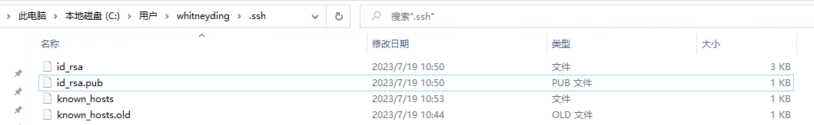
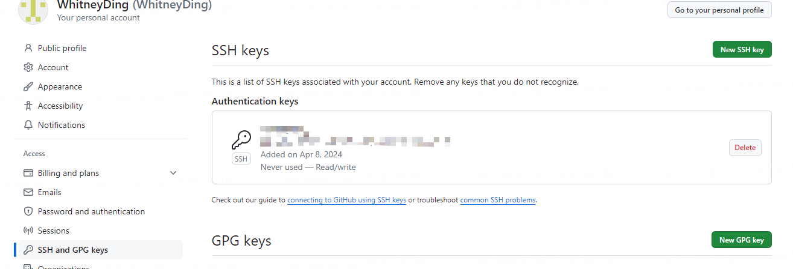

# 新建项目链接到 github

## 一、初始化

`git init`

## 二、添加.gitignore

```
node_modules
.DS_Store
dist
dist-ssr
cache
.cache
.temp
*.local
```

## 三、推送

### 3.1 添加远程仓库到本地

```
git add .
git commit -m 'init'
git branch -M master
git remote add origin https://github.com/WhitneyDing/palette.git
```

### 3.2 推送至远程

`git push -u origin master`
这里的-u 代表下一次推送直接 git push 就可以

## 四.配置 ssh

关于为什么要配置：
设置了公钥之后你的机器和 github 通信的时候, github 可以通过公钥识别出你是可信赖用户，这样就不需要每次 git 和 github 通信的时候都要输入密码了。

### 4.1 先检查是否已存在公钥和私钥

目录如下：


id_rsa：私钥（私有的钥匙，不能公开）
id_rsa.pub：公钥（可以公开的钥匙）

### 4.2 复制公钥进入 github


