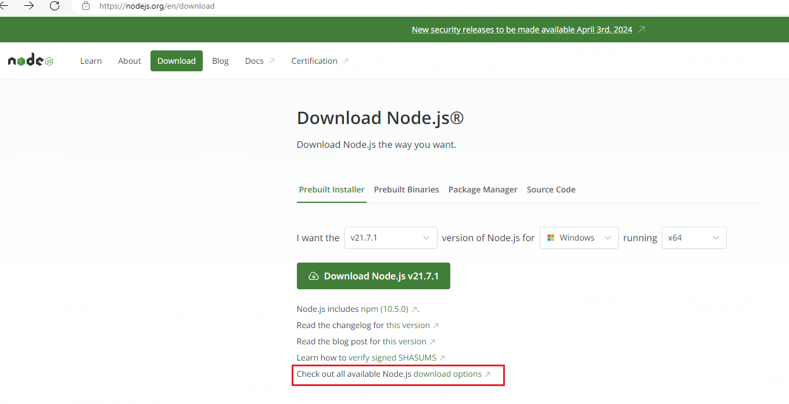
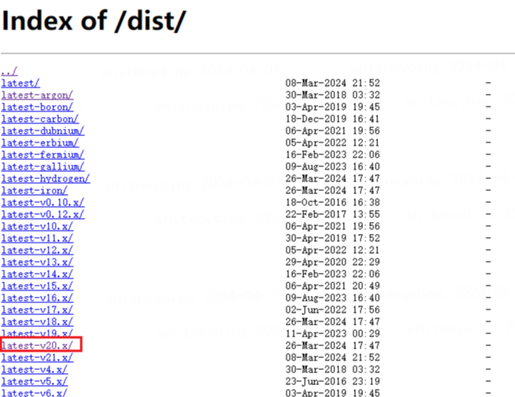
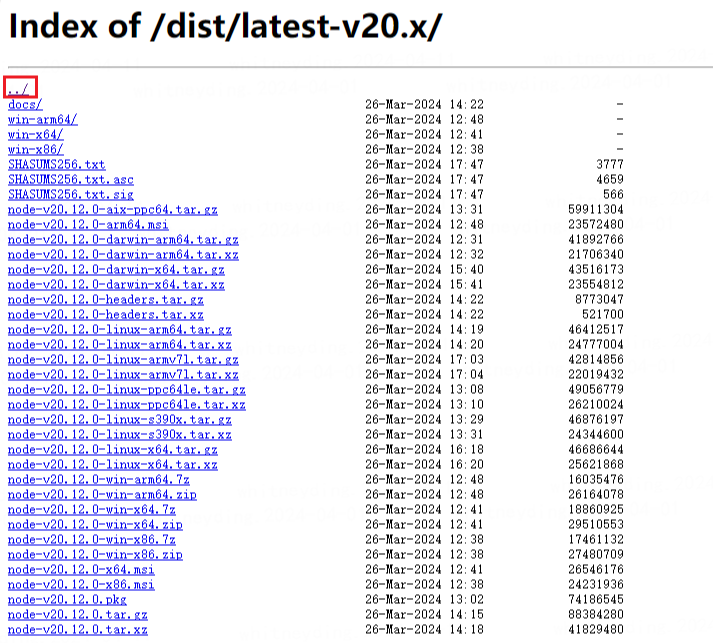
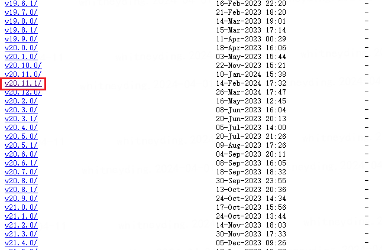
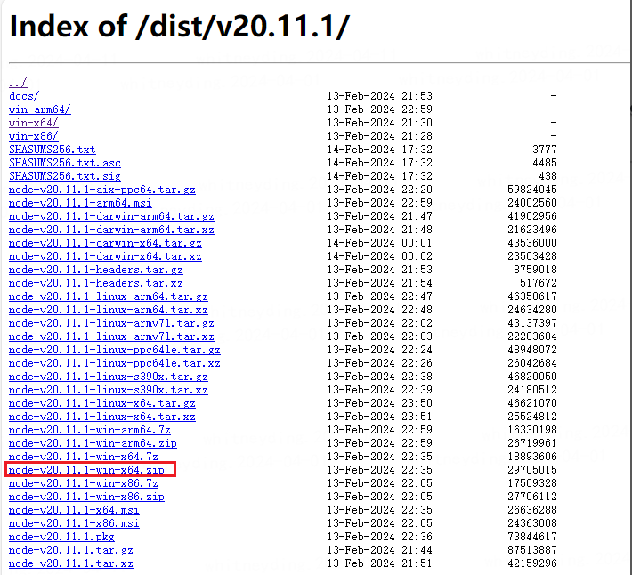
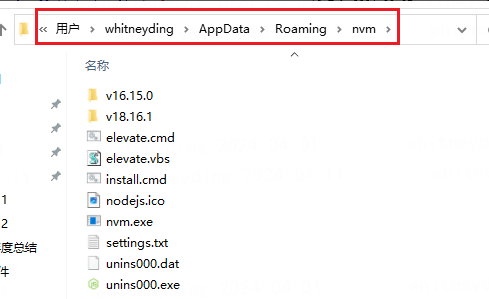
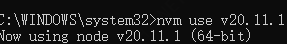

# node 版本切换

## 1.查看 nvm 下管理的所有 node 版本

nvm list

## 2.下载新的 node 版本(其中 v 后面为版本号)

nvm install v11.xx.x

## 3.离线下载

### 3.1 去官网

[Node.js — Download Node.js® (nodejs.org)](https://nodejs.org/en/download)

选中需要的版本

点 ../ 进去查看所有 v20 版本下的小版本

往下滑找到我需要的 v20.11.1

找到 zip 文件下载

### 3.2 解压到 nvm 目录

一般 nvm 目录在这里：

将解压的包名更名为 v20.11.1 就可以了

### 3.3 使用管理员命令行切换

`nvm use v20.11.1`
注意：要以管理员打开终端，不然可能会报错乱码
乱码可能的错误原因：

- 安装路径是否包含中文
- 安装路径有空格
- cmd 使用是否是管理员方式打开
- 配置文件 setting.txt 中配置的路径和实际安装路径是否相符
  看见 now using node vxx.xx.x 即可
  
