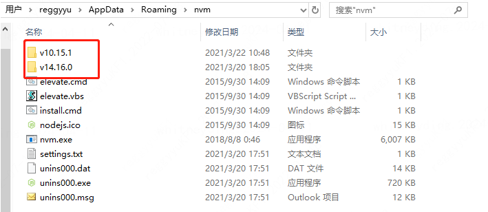

# nvm 安装

## 一、本地安装（可以联网）

### 1、卸载本地 nodejs，确认 C:\Users\name\AppData\Roaming 下面的 npm/npm-cache 卸载干净，还有 C:\Program Files 下的 nodejs 文件删掉

### 2、下载安装【windows 版本】

- github/oschina 中搜索：nvm-windows 。提示上 Gitee 下载 / 微众云盘下载地址
- 下载 nvm-setup.zip【nvm-noinstall.zip 本地尝试安装始终报拒绝访问注册表路径】
- 安装时使用默认指定路径，也可以自定义路径，需要确保路径中没有空格，确保路径所在文件夹为空文件夹

### 3、用管理员权限打开 git-bash（推荐）/powerShell/cmd，设置 node.js 镜像

`nvm node_mirror http://npm.taobao.org/mirrors/node/`

### 4、设置 npm 镜像

`nvm npm_mirror https://npm.taobao.org/mirrors/npm/`

### 5、安装指定版本号

`nvm install [node_version] // 例如：nvm install 10.16.1`

### 6.其它命令

```
nvm ls // 查看已安装 node 版本
nvm use [node_version] // 切换 node 版本
nvm --version // nvm 的版本
```

### 7.问题：

- exit status 1：请用管理员权限打开 shell
- exit status 145: the directory is not empty，卸载 nvm，重装时候确保所写路径文件夹为空
- exit status 1/145 乱码，用 git-bash 执行命令，就可以看见非乱码的错误信息

## 二、离线安装

### 1、卸载 nodejs

### 2、离线安装 nvm-windows

### 3、将【本地联网安装】安装路径下(C:\Users\xxxxxx\AppData\Roaming\nvm)版本文件，拷贝至离线安装的对应文件夹下


