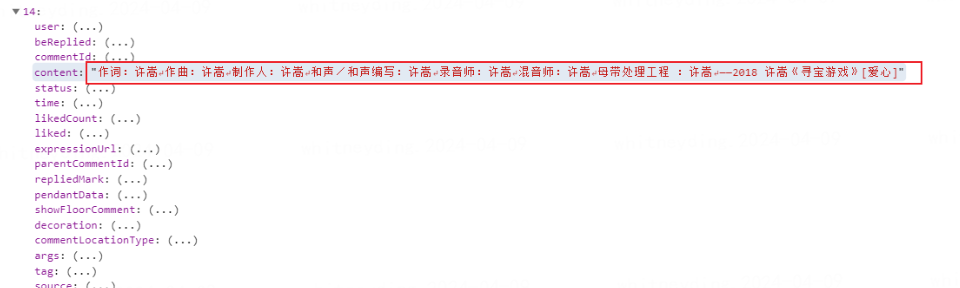
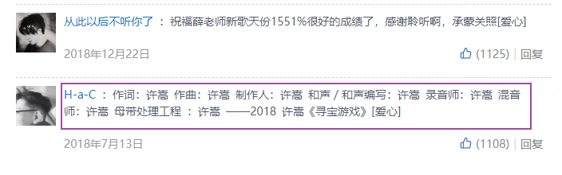
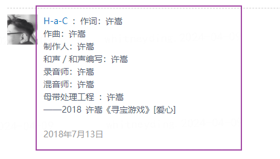

### 一、背景

> 在文档站建设中，评论区会有用户输入换行的段落，但是传到后端再回显到前端后，并不会显示换行。

后端传回一个文本数据：

文本内容就是上面圈着的一部分，内容中包含换行符（↵）.对于这类型的数据，在前端页面是需要进行稍微处理才能正常显示。如果没有经过处理，那么内容是不会在有换行符的位置进行换行显示的：

而正常的显示应该是：

下面两种方法可以实现这种效果：

### 二、解决方法

#### 方法一(下面是在 Vue 中实现的，但所有框架思想一样)

```vue
//部分代码：
<div class="commendContent" v-html="commendContent"></div>

//计算属性
computed: {
    commendContent () {
      //this.commend.content是后端传回来的文本数据，就是要对这个数据进行处理
      let arr = this.commend.content.split("");
      return arr.map((item) => {
        return item === "\n" ? "<br>" : item
      }).join("")
    }
},
```

思想：将文本字符串转化为数组，然后将数组中“\n”换成浏览器正常解析的换行标签<br>即可。(后端传回来的“↵”就是\n)，上面同样可以使用正则表达式来将字符串的换行符转换为< br >，那么就不用转换为数组了。

#### 方法二

给展示内容的容器 div 加上下面这句 CSS 代码即可：

```
white-space:pre-line;
或
white-space:pre-wrap;
```

- white-space CSS 属性是用来设置如何处理元素中的 空白。

- pre-wrap:连续的空白符会被保留。在遇到换行符或者< br >元素，或者需要为了填充「行框盒子(line boxes)」时才会换行。
  pre-line 连续的空白符会被合并。在遇到换行符或者< br >元素，或者需要为了填充「行框盒子(line boxes)」时会换行。
