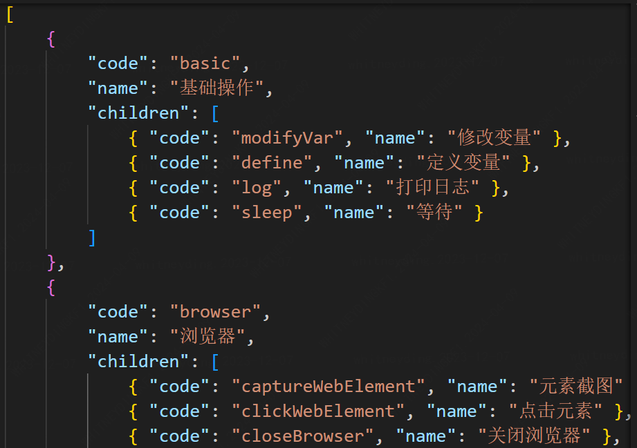

# iconify 脚本生成 svg 图标

## 一、背景

几十上百个图标资源，现在我有两个工程都需要引入它们，我又不想在每个工程目录中都导入这个图标文件夹，是否能做到只导入一个 json 文件就可以引用我自定义的图标库呢?

## 二、解决办法

iconify 官网：https://iconify.design/getting-started/

使用 iconify/tools 写脚本将图标文件夹转换为 json 文件，用`unplugin icons` 读取此 json 文件就可以

> 需要准备

- 一段源文件代码 meta.json，定义了每个 svg 的名字
  

* 一段 js 脚本
  可仿照官网的来写
  [Export all Iconify icons as SVG](https://iconify.design/docs/libraries/tools/examples/export-svg.html)

  先安装`npm install --save-dev @iconify/tools`

  导入：

  ```js
  import fs from "node:fs";
  import path from "node:path";
  import { fileURLToPath } from "node:url";
  // Installation: npm install --save-dev @iconify/tools
  import { SVG, blankIconSet, cleanupSVG, runSVGO } from "@iconify/tools";
  ```

  关于 fileURLToPath、import.meta、path.dirname 等的用法，详见[import.meta](../../js/import.meta.md)
